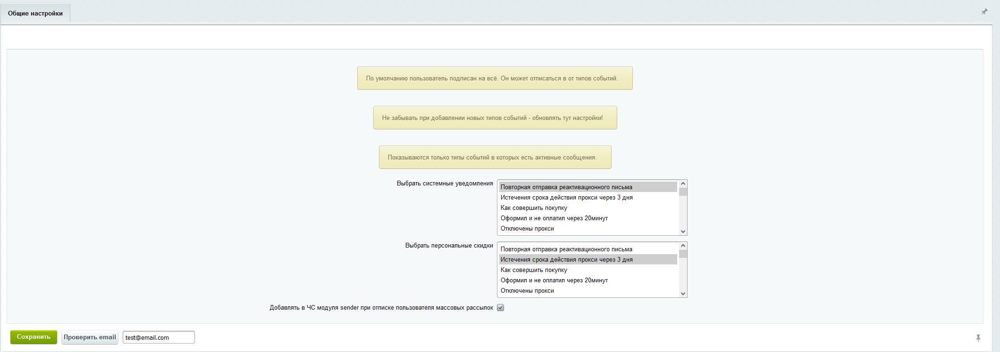

# crimson.unsubscribe
Отписка от писем и рассылок 1C-Битрикс

1. Заходим в настройки и выбираем нужные нам типы событий
* По умолчанию пользователь подписан на всё. Он может отписаться в от типов событий.
* Не забывать при добавлении новых типов событий - обновлять тут настройки!


2. В публичной части добавляем компонет. 
```
<?
    $APPLICATION->IncludeComponent(
        "crimson:unsubscribe.personal",
        ".default",
        array(
            "COMPONENT_TEMPLATE" => ".default"
        ),
        false
    );
?>
```
* Авторизация либо по сессии, либо по email+token из письма.

3. В почтовые шаблоны добавить переменную **#UNSUBSCRIBE_LINK#**



# Установка
Скопировать модуль в /local/modules и установить через админку.

# Рекомендации
